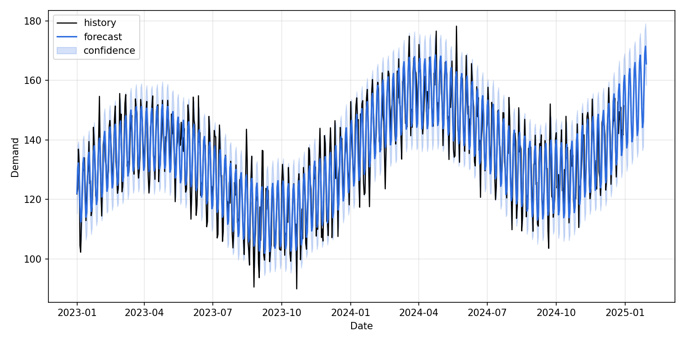

# Supply Chain Forecasting Lab

CLI-first demand forecasting with Prophet and a reproducible evaluation flow. Built to show automation readiness (CLI + n8n) and measurable forecast quality.

## Contents
- [What I Built & Why](#what-i-built--why)
- [Decisions & Tradeoffs](#decisions--tradeoffs)
- [Architecture & Flow](#architecture--flow)
- [Components & Versions](#components--versions)
- [Runbook (Setup -> Generate -> Forecast)](#runbook-setup---generate---forecast)
- [Results & Evidence](#results--evidence)
- [Project Layout](#project-layout)
- [Notes](#notes)

## What I Built & Why
- **Forecasting pipeline**: Prophet-based demand forecasting with holdout evaluation (MAE/MAPE).
- **Automation-first CLI**: reproducible runs without notebooks; easy to wire into schedulers.
- **n8n orchestration**: workflow triggers CLI while keeping business logic in Python.

## Decisions & Tradeoffs
- **Prophet** for fast, interpretable forecasting; tradeoff is lower flexibility than deep models.
- **CLI-first** instead of notebooks to favor automation; tradeoff is less interactive exploration.
- **Synthetic data** for repeatability; tradeoff is less realism vs production data.

## Architecture & Flow
```
CSV input -> Prophet fit -> Forecast + metrics -> PNG plot + CSV outputs
```

## Components & Versions
- Python 3.x
- Prophet, pandas, numpy, matplotlib
- n8n (optional orchestration)

## Runbook (Setup -> Generate -> Forecast)
1) Create a virtualenv:
   ```bash
   cd /path/to/supply-chain-forecasting-lab
   python3 -m venv .venv
   source .venv/bin/activate
   ```
2) Verify dependencies, install if missing:
   ```bash
   python -c "import prophet" || pip install -r requirements.txt
   python -c "import pandas, numpy, matplotlib"
   ```
3) Generate synthetic data:
   ```bash
   python main.py generate --out-path data/synthetic_demand.csv --start-date 2023-01-01 --periods 730 --freq D
   ```
4) Run forecast + evaluation:
   ```bash
   python main.py forecast \
     --data-path data/synthetic_demand.csv \
     --horizon 30 \
     --test-periods 60 \
     --plot-path outputs/forecast.png \
     --out-forecast outputs/forecast.csv
   ```

## Results & Evidence
- 730-day synthetic series with a 60-day holdout evaluation (MAE/MAPE printed during run).
- Outputs: `outputs/forecast.csv` and `outputs/forecast.png`.
- Forecast plot (example output):



## Project Layout
- `data/`: input CSVs and synthetic data.
- `outputs/`: forecast plots and exported forecasts.
- `watchtower/`: forecasting utilities.
- `main.py`: CLI entry point.
- `n8n/`: workflow and runbook.

## Notes
- Input CSV expects `ds` (date) and `y` (value). If yours differ, pass `--date-col` and `--value-col`.
- `--test-periods` runs a holdout evaluation and prints MAE/MAPE.
